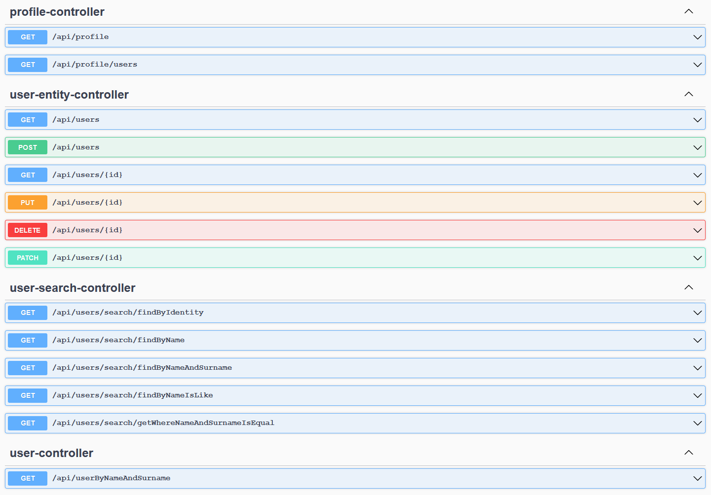
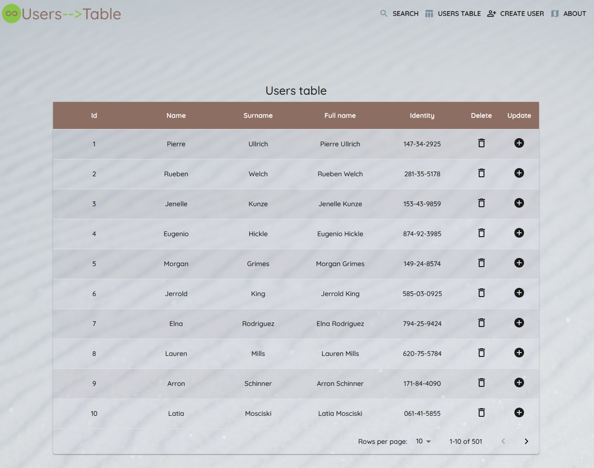
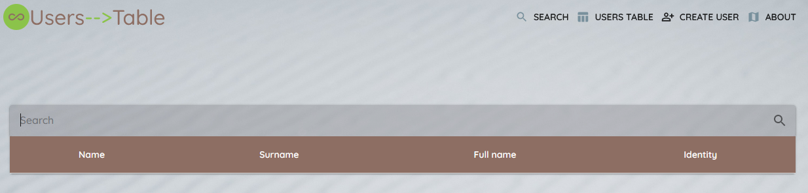
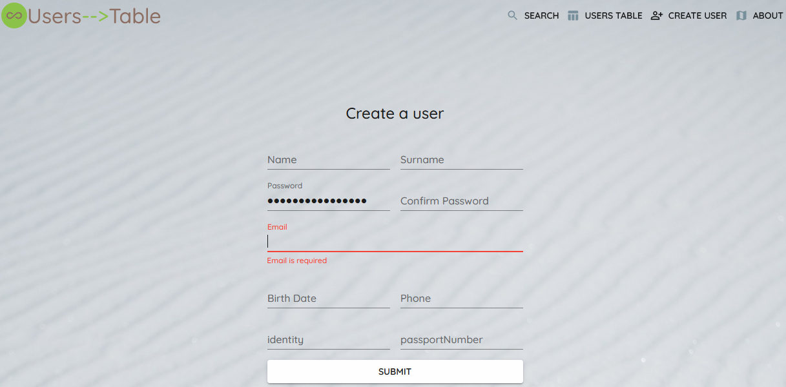

# 1. Introduction
   This is a Spring framework and React.js made User Management API Web Service. Main works include:
   Used Spring framework to support "User Management API" search, listing, update, delete and more 
   (dependency injection, inversion of control, HATEOAS, REST API, etc.). Utilized Hibernate, 
   Spring JPA to provide better support of database operations. React.js app includes simple components 
   with user table, user search and create user form. 
Back-end:
* Spring Boot 
* Hibernate
* JPA
* Lombok
* H2 database
* Spring data rest
* Spring hateoas
* Swagger

Front-end:

* React (With hooks)
* React Router
* Yarn
* Axios
* Formik (feel free to replace with preferred lib)
* Yup (for form validation)
* react-router-dom library for routing
* Material UI for styling

## 2. Documentation API (Swagger) by accessing
- `http://localhost:9090/swagger-ui.html`

All end-points are created automatically by Spring data rest and one custom end point. 
Spring app Endpoint:

### React.js app functionality
Run React app
~~~~
npm install
npm start
~~~~
Frontend URLFrontend URL
~~~~
http://localhost:3000/
~~~~

